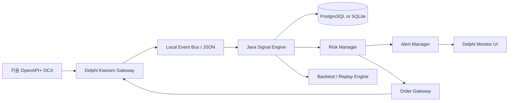
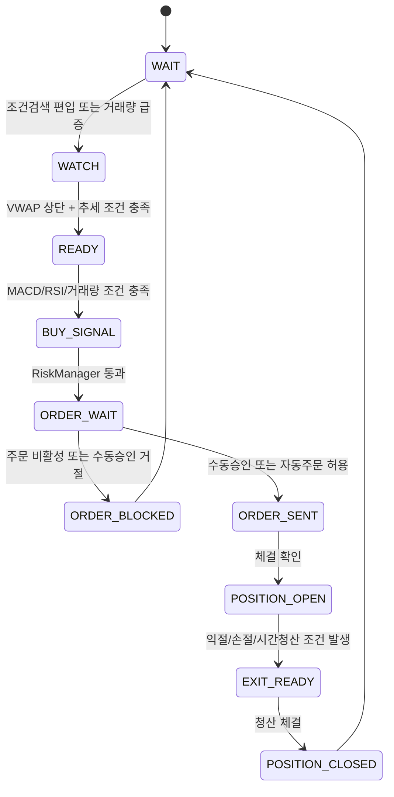

# 키움증권 OpenAPI+ 기반 실시간 종목발굴 및 매수타이밍 프로그램 개발계획서

- **문서 버전**: v0.1
- **작성일**: 2026-06-15
- **대상 시장**: 한국 주식시장 KOSPI/KOSDAQ
- **대상 API**: 키움증권 OpenAPI+
- **개발 보조 도구**: OpenAI Codex CLI / Codex IDE / Codex Cloud 선택 사용
- **권장 개발 언어**: Delphi XE7 + Java 17 이상
- **초기 운영 방식**: 자동매수 금지, 실시간 종목발굴 및 매수타이밍 알림 우선
- **주의**: 본 문서는 투자 자문이 아니라 소프트웨어 개발 계획서이다. 실매매 적용 전 모의투자, 리플레이 테스트, 소액 검증, 법적 검토가 필요하다.

---

## 1. 작업 전 체크리스트

1. **키움 OpenAPI+ 사용 등록 확인**
   - 키움 계좌, HTS ID 연결, OpenAPI+ 사용 등록 여부 확인.
2. **개발 PC 환경 확인**
   - Windows 기반 개발 환경, 키움 OpenAPI+ 설치, KOA Studio 사용 가능 여부 확인.
3. **API 방식 확정**
   - 본 계획서는 `키움 OpenAPI+ OCX`를 1차 대상으로 한다.
   - 키움 REST API는 별도 계획으로 분리한다.
4. **운영 방식 확정**
   - 1차 MVP는 `자동주문`이 아니라 `실시간 후보 발굴 + 매수신호 알림 + 수동승인`으로 제한한다.
5. **전략 기준 확정**
   - MACD + RSI를 핵심 매수타이밍 지표로 사용하되, 거래대금, 거래량, VWAP, 가격 위치, 리스크 조건을 함께 적용한다.
6. **Codex 작업 기준 확정**
   - 저장소에 `AGENTS.md`, 테스트 명령, 코딩 규칙, 금지사항을 명확히 작성한 뒤 Codex 작업을 시작한다.
7. **보안 기준 확인**
   - 계좌번호, 인증서, 비밀번호, API 계정 정보는 저장소에 절대 커밋하지 않는다.

---

## 2. 개발 목표

### 2.1 최종 목표

한국증시 장중 실시간 데이터를 수신하여 다음을 수행하는 프로그램을 개발한다.

1. **실시간 종목발굴**
   - 키움 조건검색, 거래량 급증, 거래대금, 가격 돌파, VWAP 위치를 이용해 후보 종목을 선별한다.
2. **매수타이밍 판단**
   - MACD, RSI, 거래량, 가격 위치, 과열 제외 조건을 조합하여 매수 후보 신호를 발생시킨다.
3. **리스크 제어**
   - 손절, 1일 최대손실, 종목당 최대투입금, 중복매수 제한, API 장애 대응을 구현한다.
4. **운영 UI 제공**
   - 후보 종목, 지표값, 신호 발생 사유, 주문 가능 여부, 로그를 Delphi 화면에서 확인한다.
5. **검증 가능성 확보**
   - 모든 신호는 당시 가격, 거래량, 지표값, 판단 결과, 거절 사유를 DB에 저장한다.

### 2.2 MVP 목표

MVP 범위는 다음으로 제한한다.

```text
실시간 데이터 수신
  → 1분봉 생성
  → MACD/RSI/VWAP 계산
  → 후보 종목 점수화
  → 매수타이밍 알림
  → 신호 로그 저장
```

MVP에서는 실제 주문 기능을 구현하더라도 기본값은 `비활성화`로 둔다.

---

## 3. 공식 문서 기반 API 전제

| 구분 | 확인 내용 | 설계 반영 |
|---|---|---|
| OpenAPI+ 역할 | 사용자가 직접 만든 투자전략을 키움 모듈에 연결하여 시세조회, 잔고조회, 주문 등을 수행할 수 있다. | `KiwoomGateway`를 별도 모듈로 분리한다. |
| 사용 절차 | OpenAPI 사용신청, 설치, OCX 탑재 프로그램 제작, 테스트 및 디버깅 절차가 필요하다. | Delphi XE7 또는 Windows Gateway가 OCX를 직접 호스팅한다. |
| TR 호출 제한 | 초당 5건, 분당 100건, 시간당 1,000건 제한이 명시되어 있다. | 모든 TR 요청은 `RateLimiter`를 통과시킨다. |
| 실시간 시세 제한 | 실시간 시세 수신은 화면번호 최대 200개, 화면당 최대 100종목 제한이 명시되어 있다. | `ScreenNoManager`와 종목 등록 풀을 구현한다. |
| 조건검색 | HTS 조건검색 화면에서 저장한 조건식을 API로 불러오고, 실시간 편입/이탈 이벤트를 받을 수 있다. | 후보 종목 1차 필터는 키움 조건검색을 사용한다. |
| 실시간 조건검색 제한 | 실시간 조건검색은 최대 10개 조건까지 제한되는 것으로 개발가이드에 명시되어 있다. | 실시간 조건식은 핵심 조건 1~3개만 운영한다. |
| 실시간 등록 | `SetRealReg`를 통해 화면번호, 종목코드 목록, FID 목록을 등록하며, 종목과 FID는 각각 한 번에 100개 제한이 명시되어 있다. | 실시간 등록은 100종목 단위로 분할한다. |
| 주문/체결 이벤트 | `SendOrder`, `OnReceiveChejanData` 등 주문 및 체결 관련 메소드/이벤트가 제공된다. | 주문 상태 머신과 체결 이벤트 처리기를 별도 구현한다. |
| Codex CLI | Codex CLI는 로컬 터미널에서 실행되며 선택한 디렉터리의 코드를 읽고, 수정하고, 명령을 실행할 수 있다. | Codex가 안전하게 수정할 수 있도록 저장소 구조, 테스트, AGENTS.md를 먼저 준비한다. |
| Codex 저장소 가이드 | OpenAI는 `AGENTS.md`로 코드베이스 탐색 방법, 테스트 명령, 프로젝트 규칙을 Codex에 알려줄 수 있다고 설명한다. | 루트와 주요 하위 폴더에 `AGENTS.md`를 배치한다. |

---

## 4. 개발 범위

### 4.1 포함 범위

- 키움 OpenAPI+ 로그인 및 연결 상태 관리
- TR 요청 제한 관리
- 실시간 조건검색 연동
- 실시간 시세 등록/해제
- 실시간 체결 데이터 정규화
- 1분/3분/5분 봉 생성
- MACD, RSI, VWAP, 이동평균, 거래량 급증률 계산
- 후보 종목 점수화
- 매수타이밍 신호 발생
- 알림, 로그, 대시보드
- 모의 주문 인터페이스 또는 주문 비활성 상태의 주문 검증 로직
- 백테스트 및 리플레이 테스트 기반 검증

### 4.2 제외 범위

초기 버전에서는 다음을 제외한다.

- 무조건 자동매수
- 타인 계좌 운용
- 외부 사용자 대상 유료 신호 제공
- 신용/미수/공매도 전략
- 파생상품 자동매매
- 고빈도 초단타 매매
- 뉴스, 공시, 재료 분석 자동화
- AI 예측 모델 기반 매매 판단

---

## 5. 권장 시스템 아키텍처

### 5.1 전체 구조



### 5.2 설계 선택 이유

| 구성 | 선택 이유 |
|---|---|
| Delphi XE7 Gateway | 키움 OpenAPI+ OCX 이벤트를 Windows 환경에서 안정적으로 수신하기 위함 |
| Java Signal Engine | 지표 계산, 전략 판단, 테스트 자동화, 백테스트 구조화가 용이함 |
| Local Event Bus | Delphi와 Java를 느슨하게 연결하여 장애 전파를 줄임 |
| DB 저장 | 신호 근거, 성과 분석, 장애 추적, 전략 개선에 필요함 |
| Delphi Monitor UI | 실시간 운영 화면, 수동승인, 장애 확인에 적합함 |

### 5.3 대안 구조

| 대안 | 설명 | 장점 | 단점 |
|---|---|---|---|
| A안: Delphi 단일 프로그램 | Delphi XE7에서 키움 API, 지표, UI, 주문을 모두 처리 | 배포 단순, 키움 OCX 연동 쉬움 | 테스트 자동화와 복잡한 전략 유지보수가 어려움 |
| B안: Delphi Gateway + Java Engine | Delphi는 키움 API, Java는 전략/리스크/로그 담당 | 유지보수, 테스트, 확장성 우수 | 모듈 간 통신 설계 필요 |
| C안: C# Gateway + Java Engine | C#이 키움 OCX를 담당 | COM/OCX 연동과 Windows 서비스화가 편리 | 기존 Delphi 자산 활용도 낮음 |

**권장안은 B안**이다.

---

## 6. 저장소 구조

```text
kiwoom-stock-signal/
  ├─ AGENTS.md
  ├─ README.md
  ├─ docs/
  │   ├─ development-plan.md
  │   ├─ api-constraints.md
  │   ├─ strategy-spec.md
  │   ├─ risk-policy.md
  │   └─ operation-manual.md
  ├─ gateway-delphi/
  │   ├─ KiwoomGateway.dproj
  │   ├─ src/
  │   │   ├─ MainForm.pas
  │   │   ├─ KiwoomApiUnit.pas
  │   │   ├─ ScreenNoManager.pas
  │   │   ├─ TrRateLimiter.pas
  │   │   ├─ ConditionSearchManager.pas
  │   │   ├─ RealTimeRegManager.pas
  │   │   ├─ OrderGatewayUnit.pas
  │   │   ├─ JsonEventPublisher.pas
  │   │   └─ AppConfigUnit.pas
  │   └─ tests/
  ├─ signal-engine-java/
  │   ├─ pom.xml
  │   └─ src/
  │       ├─ main/java/kr/co/mango/stock/
  │       │   ├─ app/
  │       │   ├─ market/
  │       │   ├─ indicator/
  │       │   ├─ scanner/
  │       │   ├─ signal/
  │       │   ├─ risk/
  │       │   ├─ order/
  │       │   ├─ repository/
  │       │   └─ config/
  │       └─ test/java/kr/co/mango/stock/
  ├─ replay-engine/
  │   ├─ sample-data/
  │   └─ scripts/
  ├─ sql/
  │   ├─ 001_schema.sql
  │   ├─ 002_indexes.sql
  │   └─ 003_seed_strategy_config.sql
  ├─ tools/
  │   ├─ codex-prompts/
  │   ├─ log-parser/
  │   └─ data-export/
  └─ .codex/
      └─ config.toml
```

---

## 7. Codex 개발 운영 계획

### 7.1 Codex 사용 원칙

1. **작업 단위를 작게 분리한다.**
   - 예: `RSI 계산기 구현`, `TR RateLimiter 구현`, `SignalLog 테이블 생성`처럼 독립적인 단위로 요청한다.
2. **테스트 없는 코드 생성을 금지한다.**
   - Java 로직은 JUnit 테스트를 같이 작성한다.
   - Delphi 로직은 가능한 경우 DUnitX 또는 순수 함수 단위 테스트를 작성한다.
3. **키움 실서버 호출 코드는 Mock을 먼저 만든다.**
   - Codex가 실계좌 주문 코드를 무심코 실행하지 않도록 한다.
4. **자동주문 기본값은 항상 OFF이다.**
   - 환경설정에서 `order.enabled=false`가 기본값이어야 한다.
5. **민감정보를 저장소에 두지 않는다.**
   - 계좌번호, 인증정보, HTS ID, 비밀번호, 인증서 경로는 `.env.local` 또는 Windows 사용자 환경에 둔다.
6. **Codex 결과는 반드시 코드 리뷰한다.**
   - 특히 주문, 잔고, 체결, 손절, 예외 처리 코드는 수동 검증한다.

### 7.2 AGENTS.md 초안

```md
# AGENTS.md

## 프로젝트 목적
키움 OpenAPI+ 기반 실시간 종목발굴 및 매수타이밍 알림 프로그램을 개발한다.
초기 버전은 자동매수가 아니라 알림과 수동승인을 목표로 한다.

## 기술 스택
- Delphi XE7: 키움 OpenAPI+ OCX 연동, 실시간 이벤트 수신, 운영 UI
- Java 17: 지표 계산, 후보 종목 스캐너, 매수타이밍 엔진, 리스크 관리, 로그 저장
- DB: PostgreSQL 우선, 단일 PC MVP는 SQLite 허용

## 코딩 규칙
- 주석은 한국어로 작성한다.
- 기존 로직을 삭제하지 말고 개선 시 주석으로 변경 사유를 남긴다.
- 주문 관련 기본값은 항상 비활성화한다.
- 계좌, 인증, 비밀번호, 인증서 경로는 코드와 테스트 데이터에 포함하지 않는다.
- 모든 Java 비즈니스 로직은 JUnit 테스트를 작성한다.
- 가격은 정수 원 단위로 처리하고, 수익률과 지표는 BigDecimal 또는 double 사용 기준을 명시한다.

## 테스트 명령
- Java: `mvn test`
- Java 패키징: `mvn package`
- SQL 검증: 로컬 DB에 schema 적용 후 기본 insert/select 확인

## 금지 사항
- 실계좌 주문을 실행하는 테스트 작성 금지
- 인증정보 하드코딩 금지
- API 제한을 무시한 반복 TR 호출 금지
- 아직 완성되지 않은 봉의 종가를 확정봉처럼 사용하는 로직 금지
```

### 7.3 Codex 프롬프트 예시

```text
signal-engine-java 모듈에 RSI 계산기를 구현해줘.
요구사항:
1. 파일: src/main/java/kr/co/mango/stock/indicator/RsiCalculator.java
2. period 기본값은 14로 하되 생성자에서 변경 가능하게 해줘.
3. 입력은 List<MinuteBar>, 출력은 OptionalDouble로 해줘.
4. 봉 개수가 부족하면 OptionalDouble.empty()를 반환해줘.
5. 주석은 한국어로 작성해줘.
6. JUnit 테스트를 반드시 작성해줘.
7. mvn test가 통과하도록 해줘.
```

```text
gateway-delphi 모듈에 TR 호출 제한 관리 클래스를 작성해줘.
요구사항:
1. 파일: src/TrRateLimiter.pas
2. 초당 5건, 분당 100건, 시간당 1000건 제한을 설정값으로 받게 해줘.
3. CanRequest, MarkRequest, NextAvailableTime 메소드를 제공해줘.
4. 주문 요청과 조회 요청을 구분할 수 있게 enum을 추가해줘.
5. 주석은 한국어로 작성해줘.
6. 기존 코드가 없으면 독립 유닛으로 작성해줘.
```

---

## 8. Kiwoom Gateway 설계

### 8.1 주요 책임

`KiwoomGateway`는 키움 OpenAPI+와 직접 연결되는 유일한 모듈이다.

| 책임 | 설명 |
|---|---|
| 로그인 | `CommConnect` 호출 및 `OnEventConnect` 이벤트 처리 |
| 계좌 정보 조회 | `GetLoginInfo`를 통한 계좌/사용자 정보 확인 |
| TR 요청 | `CommRqData` 요청, `OnReceiveTrData` 응답 처리 |
| 실시간 시세 | `SetRealReg`, `OnReceiveRealData`, `SetRealRemove` 처리 |
| 조건검색 | `GetConditionLoad`, `GetConditionNameList`, `SendCondition`, `OnReceiveRealCondition` 처리 |
| 주문 | `SendOrder` 호출, 주문번호 및 오류 처리 |
| 체결/잔고 | `OnReceiveChejanData` 이벤트 처리 |
| 이벤트 발행 | Java 엔진으로 JSON 이벤트 송신 |
| 장애 대응 | 연결 끊김, 이벤트 폭주, TR 제한 초과, 주문 실패 로깅 |

### 8.2 Kiwoom Gateway 내부 구성

```text
KiwoomGateway
  ├─ KiwoomApiUnit
  │   ├─ CommConnect
  │   ├─ CommRqData
  │   ├─ SendOrder
  │   ├─ SetRealReg
  │   └─ SetRealRemove
  ├─ ScreenNoManager
  ├─ TrRateLimiter
  ├─ ConditionSearchManager
  ├─ RealTimeRegManager
  ├─ OrderGatewayUnit
  ├─ ChejanEventParser
  ├─ RealDataParser
  └─ JsonEventPublisher
```

### 8.3 이벤트 처리 흐름

#### 로그인

```text
프로그램 시작
  → CommConnect 호출
  → OnEventConnect 수신
  → 성공 시 계좌/환경정보 로딩
  → 실패 시 재시도 또는 종료
```

#### 조건검색

```text
GetConditionLoad 호출
  → OnReceiveConditionVer 수신
  → GetConditionNameList 호출
  → 조건명/조건인덱스 파싱
  → SendCondition(..., nSearch=1) 호출
  → OnReceiveTrCondition으로 초기 종목 수신
  → OnReceiveRealCondition으로 실시간 편입/이탈 수신
```

#### 실시간 시세

```text
조건검색 편입 종목 발생
  → RealTimeRegManager 등록 대상 추가
  → SetRealReg 호출
  → OnReceiveRealData 수신
  → RealDataParser로 FID 파싱
  → TickEvent JSON 발행
```

#### 주문 및 체결

```text
Java Signal Engine에서 주문 후보 이벤트 발생
  → RiskManager 사전 검증
  → 수동승인 또는 주문 비활성 상태 확인
  → SendOrder 호출
  → OnReceiveChejanData 수신
  → 주문/체결/잔고 상태 갱신
  → OrderEvent JSON 발행
```

### 8.4 ScreenNoManager 설계

| 항목 | 설계 기준 |
|---|---|
| 화면번호 형식 | 4자리 문자열 |
| 용도별 분리 | 조건검색, 실시간시세, TR조회, 주문/잔고 구분 |
| 재사용 정책 | 실시간 해제 후 재사용 |
| 상한 관리 | 화면번호 최대 사용량을 설정값으로 관리 |
| 오류 대응 | 화면번호 고갈 시 신규 등록 중단 및 알림 |

### 8.5 TrRateLimiter 설계

```text
입력:
  - 요청 유형: TR 조회, 계좌 조회, 차트 조회, 기타
  - 요청 시각

처리:
  - 최근 1초 요청 수 확인
  - 최근 1분 요청 수 확인
  - 최근 1시간 요청 수 확인
  - 제한 초과 시 요청 보류 또는 거절

출력:
  - ALLOW
  - WAIT_UNTIL(timestamp)
  - REJECT_LIMIT_EXCEEDED
```

### 8.6 실시간 FID 1차 범위

개발가이드에서 예시로 확인되는 FID는 다음과 같다.

| FID | 의미 | 사용 여부 |
|---:|---|---|
| 9001 | 종목코드 | 필수 |
| 10 | 현재가 | 필수 |
| 13 | 누적거래량 | 필수 |

추가 FID는 KOA Studio 실시간 목록에서 확인 후 `docs/api-constraints.md`에 명시한다. 확인 전에는 임의로 필드명을 생성하지 않는다.

---

## 9. Java Signal Engine 설계

### 9.1 주요 패키지

```text
kr.co.mango.stock
  ├─ app
  │   └─ SignalEngineApplication.java
  ├─ market
  │   ├─ TickEvent.java
  │   ├─ MinuteBar.java
  │   ├─ BarInterval.java
  │   └─ MinuteBarBuilder.java
  ├─ indicator
  │   ├─ MacdCalculator.java
  │   ├─ RsiCalculator.java
  │   ├─ VwapCalculator.java
  │   └─ MovingAverageCalculator.java
  ├─ scanner
  │   ├─ RealtimeScanner.java
  │   ├─ CandidateScore.java
  │   └─ CandidateReason.java
  ├─ signal
  │   ├─ BuyTimingEngine.java
  │   ├─ BuySignal.java
  │   ├─ RejectReason.java
  │   └─ SignalStateMachine.java
  ├─ risk
  │   ├─ RiskManager.java
  │   ├─ RiskPolicy.java
  │   └─ PositionLimit.java
  ├─ order
  │   ├─ OrderRequest.java
  │   ├─ OrderResult.java
  │   └─ OrderDecision.java
  └─ repository
      ├─ SignalLogRepository.java
      ├─ TickRepository.java
      ├─ MinuteBarRepository.java
      └─ StrategyConfigRepository.java
```

### 9.2 핵심 도메인 모델

#### TickEvent

```json
{
  "eventType": "TICK",
  "source": "KIWOOM_OPENAPI_PLUS",
  "stockCode": "005930",
  "stockName": "삼성전자",
  "eventTime": "2026-06-15T09:01:05.000+09:00",
  "currentPrice": 72000,
  "accumulatedVolume": 1250000,
  "receivedAt": "2026-06-15T09:01:05.123+09:00"
}
```

#### MinuteBar

```json
{
  "stockCode": "005930",
  "interval": "M1",
  "barTime": "2026-06-15T09:01:00+09:00",
  "open": 71900,
  "high": 72100,
  "low": 71800,
  "close": 72000,
  "volume": 35000,
  "tradeAmount": 2520000000,
  "completed": true
}
```

#### BuySignal

```json
{
  "stockCode": "005930",
  "signalTime": "2026-06-15T09:35:00+09:00",
  "signalType": "BUY_CANDIDATE",
  "currentPrice": 72000,
  "candidateScore": 86,
  "macd": 15.3,
  "macdSignal": 12.8,
  "macdHistogram": 2.5,
  "rsi": 54.2,
  "vwap": 71550,
  "reason": "VWAP 상단, MACD 상향, RSI 50 이상, 거래량 증가",
  "orderEnabled": false
}
```

---

## 10. 실시간 종목발굴 전략

### 10.1 1차 후보 수집

1차 후보는 키움 HTS 조건검색을 활용한다.

권장 조건식 예시는 다음과 같다.

| 조건식명 | 목적 | 예시 |
|---|---|---|
| `MANGO_VOL_SPIKE` | 거래량 급증 종목 탐색 | 최근 거래량 급증, 당일 거래대금 증가 |
| `MANGO_BREAKOUT` | 당일 고점 또는 박스 돌파 탐색 | 신고가/당일고가 접근 |
| `MANGO_TREND` | 추세 유지 종목 탐색 | 이동평균 정배열 또는 강세 유지 |

조건식 세부 항목은 HTS 조건검색 화면에서 직접 설정하고, API에서는 저장된 조건을 불러오는 방식으로 운영한다.

### 10.2 2차 실시간 필터

| 필터 | 기본값 | 설명 |
|---|---:|---|
| 현재가 | 1,000원 이상 | 저가주 이상 급등락 회피 |
| 당일 거래대금 | 30억 원 이상 | 유동성 확보 |
| 1분 거래량 | 최근 20분 평균의 1.5배 이상 | 단기 수급 유입 확인 |
| 가격 위치 | 현재가 > VWAP | 평균 매입단가 상단 여부 확인 |
| 추세 | 5분봉 종가 > 20봉 이동평균 | 단기 추세 확인 |
| 등락률 | -3% ~ +20% | 과도한 급락/급등 회피 |
| 호가 안정성 | 스프레드 1~3틱 권장 | 체결 리스크 완화 |

### 10.3 후보 점수화

| 항목 | 조건 | 점수 |
|---|---|---:|
| 거래대금 | 당일 거래대금 기준 충족 | 20 |
| 거래량 급증 | 1분 거래량 > 20분 평균 × 1.5 | 20 |
| 가격 위치 | 현재가 > VWAP | 15 |
| 추세 | 5분봉 종가 > 20봉 이동평균 | 15 |
| 돌파 | 직전 고점 또는 당일 고가 돌파 | 15 |
| MACD | MACD선 > Signal선, Histogram 증가 | 10 |
| RSI | RSI 50 이상 또는 50 상향 | 5 |

```text
후보점수 >= 70: 관심종목
후보점수 >= 80: 매수타이밍 감시
후보점수 >= 90: 강한 매수 후보, 단 RiskManager 통과 필요
```

---

## 11. MACD + RSI 매수타이밍 전략

### 11.1 기본 파라미터

| 지표 | 기본값 | 설명 |
|---|---:|---|
| MACD Fast EMA | 12 | 단기 EMA |
| MACD Slow EMA | 26 | 장기 EMA |
| MACD Signal EMA | 9 | MACD Signal |
| RSI Period | 14 | 상대강도지수 기간 |
| 기준봉 | 1분봉, 5분봉 | 1분봉 진입, 5분봉 추세 확인 |
| VWAP | 당일 누적 | 당일 평균 체결가격 기준 |

### 11.2 추세형 매수 조건

```text
조건 1: 현재가 > VWAP
조건 2: 5분봉 종가 > 20봉 이동평균
조건 3: MACD선이 Signal선을 상향 돌파
조건 4: MACD Histogram이 2봉 이상 증가
조건 5: RSI가 50을 상향 돌파하거나 50 이상 유지
조건 6: 현재 1분 거래량 > 최근 20분 평균 거래량 × 1.5
조건 7: 직전 고점 돌파 또는 눌림 후 양봉 전환
조건 8: RiskManager 통과
```

### 11.3 눌림목 매수 조건

```text
조건 1: 당일 거래대금 기준 충족
조건 2: 가격이 VWAP 또는 20봉 이동평균 부근까지 눌림
조건 3: RSI가 40~50 구간에서 재상승
조건 4: MACD Histogram 감소세가 멈추고 재증가
조건 5: 양봉 전환 및 거래량 증가
조건 6: 직전 저점 이탈 시 손절 위치가 명확함
```

### 11.4 매수 제외 조건

```text
제외 1: RSI >= 75
제외 2: 현재가가 VWAP 대비 +3% 이상 이격
제외 3: 1분봉 장대양봉 직후 추격매수
제외 4: 호가 스프레드 과다
제외 5: VI 직전 또는 호가 공백 과다
제외 6: 동일 종목 최근 신호 후 쿨다운 미경과
제외 7: 1일 최대 손실 도달
제외 8: API 연결 불안정 또는 주문 상태 미확인
제외 9: 장마감 근접 시간 신규매수 제한
```

### 11.5 상태 머신



---

## 12. RiskManager 설계

### 12.1 기본 리스크 정책

| 항목 | 기본값 | 설명 |
|---|---:|---|
| 주문 기능 | OFF | 기본값은 주문 비활성 |
| 종목당 최대 투입 | 총자산의 5% 이하 | 집중 리스크 제한 |
| 1일 최대 손실 | 총자산의 1% 이하 | 손실 누적 방지 |
| 1회 손절 | -1.0% ~ -2.0% 또는 직전 저점 이탈 | 전략별 설정 |
| 최대 보유 종목 수 | 3~5개 | 관리 가능한 수준 유지 |
| 동일 종목 쿨다운 | 10~30분 | 반복 진입 방지 |
| 신규매수 제한 시간 | 15:10 이후 금지 | 장마감 리스크 완화 |
| API 장애 시 | 신규주문 중단 | 체결 미확인 리스크 방지 |

### 12.2 주문 전 검증 순서

```text
1. 주문 기능 활성화 여부 확인
2. 로그인 및 API 연결 상태 확인
3. 실시간 시세 정상 수신 여부 확인
4. 계좌 잔고 및 예수금 확인
5. 종목별 최대 투입금 확인
6. 1일 누적 손익 확인
7. 동일 종목 보유 여부 확인
8. 동일 종목 쿨다운 확인
9. 현재가와 호가 괴리 확인
10. 손절가 산정 가능 여부 확인
11. 주문 수량 산정
12. 주문 요청 생성
```

### 12.3 주문 수량 계산

```text
입력:
  - accountValue: 총자산
  - maxPositionRate: 종목당 최대 투입 비율
  - currentPrice: 현재가
  - stopLossPrice: 손절가
  - maxLossPerTradeRate: 1회 최대 손실 비율

계산:
  - amountLimit = accountValue × maxPositionRate
  - riskPerShare = currentPrice - stopLossPrice
  - lossLimit = accountValue × maxLossPerTradeRate
  - quantityByAmount = floor(amountLimit / currentPrice)
  - quantityByRisk = floor(lossLimit / riskPerShare)
  - orderQuantity = min(quantityByAmount, quantityByRisk)

출력:
  - orderQuantity <= 0이면 주문 거절
```

---

## 13. DB 설계 초안

### 13.1 주요 테이블

| 테이블 | 목적 |
|---|---|
| `stock_master` | 종목코드, 종목명, 시장구분 |
| `tick_event` | 실시간 수신 원본 이벤트 |
| `minute_bar` | 1분/3분/5분 봉 데이터 |
| `indicator_snapshot` | MACD, RSI, VWAP 등 지표값 |
| `candidate_signal` | 후보 종목 점수 및 사유 |
| `buy_signal_log` | 매수 신호 및 거절 사유 |
| `order_request_log` | 주문 요청 이력 |
| `order_event_log` | 주문 접수/체결/거부 이벤트 |
| `position_snapshot` | 보유 종목 상태 |
| `risk_event_log` | 리스크 차단 사유 |
| `strategy_config` | 전략 파라미터 |
| `system_event_log` | 장애, 연결, 재시작, API 제한 이벤트 |

### 13.2 buy_signal_log 예시

```sql
CREATE TABLE buy_signal_log (
    id                  BIGSERIAL PRIMARY KEY,
    stock_code           VARCHAR(20) NOT NULL,
    signal_time          TIMESTAMP NOT NULL,
    current_price        INTEGER NOT NULL,
    candidate_score      INTEGER NOT NULL,
    macd_value           NUMERIC(18, 6),
    macd_signal          NUMERIC(18, 6),
    macd_histogram       NUMERIC(18, 6),
    rsi_value            NUMERIC(18, 6),
    vwap_price           NUMERIC(18, 2),
    decision             VARCHAR(30) NOT NULL,
    reason               TEXT NOT NULL,
    order_enabled        BOOLEAN NOT NULL DEFAULT FALSE,
    created_at           TIMESTAMP NOT NULL DEFAULT CURRENT_TIMESTAMP
);
```

---

## 14. 개발 단계 및 일정

### 14.1 8주 개발 계획

| 주차 | 단계 | 주요 작업 | 산출물 | 완료 기준 |
|---:|---|---|---|---|
| 1주차 | 환경 구축 | 키움 OpenAPI+ 설치, KOA Studio 확인, 저장소 생성, Codex 설정 | 개발환경 문서, AGENTS.md | 로그인 테스트 성공 |
| 2주차 | Gateway 기본 | CommConnect, 연결 상태, TR RateLimiter, ScreenNoManager | Delphi Gateway 기본앱 | 로그인/연결 이벤트 로그 저장 |
| 3주차 | 조건검색 | GetConditionLoad, GetConditionNameList, SendCondition, 실시간 편입/이탈 | 조건검색 모듈 | 조건 편입/이탈 이벤트 수신 |
| 4주차 | 실시간 시세 | SetRealReg, OnReceiveRealData, TickEvent 발행 | 실시간 수신 모듈 | 후보 종목 현재가/거래량 수신 |
| 5주차 | 지표 엔진 | BarBuilder, MACD, RSI, VWAP, MA 구현 | Java Signal Engine | JUnit 테스트 통과 |
| 6주차 | 신호 엔진 | 후보 점수화, BuyTimingEngine, RiskManager 1차 | 신호 로그 | 매수 후보/거절 사유 저장 |
| 7주차 | UI/알림 | Delphi 대시보드, 알림, 수동승인 화면 | 운영 화면 | 신호 실시간 표시 |
| 8주차 | 검증 | 리플레이 테스트, 장애 테스트, 문서화 | 테스트 리포트 | MVP 운영 가능 판단 |

### 14.2 MVP 이후 단계

| 단계 | 내용 | 조건 |
|---|---|---|
| 9~10주차 | 모의주문 또는 주문 Dry-run | 주문 요청 생성과 체결 이벤트 처리 검증 |
| 11~12주차 | 소액 실거래 제한 테스트 | 1일 1~3회, 주문금액 제한, 수동승인 필수 |
| 13주차 이후 | 전략 개선 | 성과 리포트 기반 파라미터 조정 |

---

## 15. 상세 WBS

| ID | 작업명 | 담당 모듈 | 산출물 | 검증 방법 |
|---|---|---|---|---|
| WBS-001 | 저장소 초기화 | 공통 | Git repo, README, AGENTS.md | Codex가 테스트 명령 인식 |
| WBS-002 | 키움 로그인 구현 | Delphi | KiwoomApiUnit.pas | OnEventConnect 로그 확인 |
| WBS-003 | TR 제한기 구현 | Delphi | TrRateLimiter.pas | 제한 초과 요청 차단 테스트 |
| WBS-004 | 화면번호 관리자 구현 | Delphi | ScreenNoManager.pas | 화면번호 할당/해제 테스트 |
| WBS-005 | 조건식 로딩 구현 | Delphi | ConditionSearchManager.pas | 조건명 리스트 파싱 확인 |
| WBS-006 | 실시간 조건검색 구현 | Delphi | OnReceiveRealCondition 처리 | 편입/이탈 이벤트 확인 |
| WBS-007 | 실시간 등록 구현 | Delphi | RealTimeRegManager.pas | 100종목 단위 등록 확인 |
| WBS-008 | TickEvent 발행 | Delphi | JsonEventPublisher.pas | Java 수신 로그 확인 |
| WBS-009 | 1분봉 생성 | Java | MinuteBarBuilder.java | 단위 테스트 |
| WBS-010 | MACD 구현 | Java | MacdCalculator.java | HTS/샘플값 비교 |
| WBS-011 | RSI 구현 | Java | RsiCalculator.java | HTS/샘플값 비교 |
| WBS-012 | VWAP 구현 | Java | VwapCalculator.java | 수작업 계산값 비교 |
| WBS-013 | 후보 점수화 | Java | RealtimeScanner.java | 조건별 점수 테스트 |
| WBS-014 | 매수타이밍 엔진 | Java | BuyTimingEngine.java | 시나리오 테스트 |
| WBS-015 | 리스크 관리자 | Java | RiskManager.java | 주문 차단 케이스 테스트 |
| WBS-016 | DB 스키마 | SQL | 001_schema.sql | 마이그레이션 테스트 |
| WBS-017 | 대시보드 UI | Delphi | MainForm.pas | 실시간 표시 확인 |
| WBS-018 | 알림 기능 | Java/Delphi | AlertManager | 신호 발생 시 알림 확인 |
| WBS-019 | 리플레이 엔진 | Java | ReplayRunner.java | 과거 데이터 재생 테스트 |
| WBS-020 | 운영 매뉴얼 | Docs | operation-manual.md | 장애 대응 절차 검토 |

---

## 16. 테스트 계획

### 16.1 단위 테스트

| 테스트 대상 | 검증 내용 |
|---|---|
| RsiCalculator | 상승/하락/횡보 샘플에서 RSI 계산값 검증 |
| MacdCalculator | EMA, MACD, Signal, Histogram 계산값 검증 |
| VwapCalculator | 누적 거래대금/누적 거래량 기준 VWAP 검증 |
| MinuteBarBuilder | 틱 데이터가 정확한 분봉으로 집계되는지 검증 |
| RealtimeScanner | 조건별 후보 점수가 정확한지 검증 |
| BuyTimingEngine | 매수/거절 신호 분기가 정확한지 검증 |
| RiskManager | 손실 한도, 중복매수, 시간 제한 차단 검증 |

### 16.2 통합 테스트

| 테스트 | 절차 | 성공 기준 |
|---|---|---|
| 로그인 테스트 | Gateway 실행 후 CommConnect | 연결 성공 로그 저장 |
| 조건검색 테스트 | 저장 조건식 로딩 후 실시간 조회 | 편입/이탈 이벤트 수신 |
| 실시간 시세 테스트 | 후보 종목 SetRealReg 등록 | 현재가/거래량 이벤트 수신 |
| Java 연동 테스트 | TickEvent JSON 송신 | Java 엔진 수신 및 DB 저장 |
| 신호 테스트 | 조건 충족 시나리오 입력 | BuySignal 생성 |
| 리스크 차단 테스트 | 손실 한도 초과 시나리오 입력 | 주문 차단 로그 저장 |
| 장애 테스트 | 네트워크 끊김/재연결 | 신규주문 중단 및 알림 |

### 16.3 리플레이 테스트

```text
과거 틱 또는 분봉 데이터 준비
  → 실제 장중처럼 시간 순서대로 재생
  → BarBuilder/Indicator/SignalEngine 통과
  → 발생 신호와 당시 가격 저장
  → 슬리피지/수수료/세금 반영 성과 계산
```

### 16.4 실매매 전 필수 검증

1. HTS 차트와 MACD/RSI/VWAP 값 비교
2. 아직 완성되지 않은 봉의 종가를 확정봉으로 사용하지 않는지 확인
3. TR 제한 초과 시 프로그램이 멈추지 않고 요청을 보류하는지 확인
4. 실시간 등록 종목 수 제한을 초과하지 않는지 확인
5. 주문 비활성 기본값이 유지되는지 확인
6. API 연결 끊김 시 신규주문이 차단되는지 확인
7. 체결 미확인 주문이 있는 상태에서 중복주문이 발생하지 않는지 확인

---

## 17. 운영 화면 설계

### 17.1 메인 대시보드

| 영역 | 표시 내용 |
|---|---|
| 연결 상태 | 키움 로그인, 실시간 수신, Java 엔진, DB 연결 |
| 후보 종목 | 종목코드, 종목명, 현재가, 등락률, 거래대금, 점수 |
| 지표 | MACD, Signal, Histogram, RSI, VWAP, 이동평균 |
| 신호 | 신호 시간, 매수 후보 여부, 거절 사유 |
| 리스크 | 보유 종목 수, 당일 손익, 주문 가능 여부 |
| 로그 | API 오류, TR 제한, 주문 차단, 연결 이벤트 |

### 17.2 색상 및 표시 규칙

구체 색상은 구현 단계에서 정한다. 단, 다음 상태 구분은 필수이다.

| 상태 | 의미 |
|---|---|
| 정상 | 데이터 수신 및 계산 정상 |
| 주의 | 조건 일부 충족, 주문 불가 아님 |
| 차단 | 리스크 또는 API 상태로 주문 불가 |
| 오류 | 연결 실패, DB 오류, 이벤트 파싱 실패 |

---

## 18. 장애 대응 설계

| 장애 유형 | 감지 방법 | 대응 |
|---|---|---|
| 키움 연결 끊김 | OnEventConnect 또는 수신 정지 감시 | 신규주문 중단, 재로그인 안내 |
| 실시간 데이터 지연 | 마지막 TickEvent 수신 시간 확인 | 신호 발생 중단, UI 경고 |
| TR 제한 접근 | RateLimiter 카운터 확인 | 요청 보류, 사용자 알림 |
| 화면번호 고갈 | ScreenNoManager 할당 실패 | 신규 실시간 등록 중단 |
| DB 장애 | insert/update 실패 | 파일 로그 백업, 신규주문 중단 |
| Java 엔진 중단 | Health check 실패 | Gateway 단독 주문 금지, 재시작 안내 |
| 체결 미확인 | 주문 후 제한 시간 내 Chejan 미수신 | 중복주문 차단, 수동 확인 요청 |

---

## 19. 보안 및 운영 정책

### 19.1 저장소 보안

`.gitignore`에 다음을 포함한다.

```gitignore
.env
.env.local
*.key
*.pfx
*.p12
*.pem
cert/
secrets/
logs/
data/live/
*.sqlite
*.db
```

### 19.2 설정 파일 예시

```yaml
kiwoom:
  orderEnabled: false
  dryRun: true
  maxTrPerSecond: 5
  maxTrPerMinute: 100
  maxTrPerHour: 1000

strategy:
  macdFast: 12
  macdSlow: 26
  macdSignal: 9
  rsiPeriod: 14
  minTradeAmount: 3000000000
  volumeSpikeMultiplier: 1.5
  maxRsiForEntry: 75
  maxVwapGapRate: 0.03

risk:
  maxPositionRate: 0.05
  maxDailyLossRate: 0.01
  maxLossPerTradeRate: 0.003
  maxHoldingCount: 5
  cooldownMinutes: 20
  newBuyCutoffTime: "15:10:00"
```

---

## 20. 코드 작성 표준

### 20.1 공통 원칙

- 함수, 클래스, 변수의 목적을 주석으로 명확히 작성한다.
- 주석은 한국어로 작성한다.
- 원본 로직을 삭제하지 않고 개선 시 변경 사유를 남긴다.
- 예외 메시지는 원인, 입력값, 대응 방법을 포함한다.
- API 제한, 주문 차단, 체결 미확인은 반드시 로그를 남긴다.
- 지표 계산 로직은 순수 함수로 작성하여 테스트 가능하게 한다.
- 키움 API 직접 호출은 Gateway 모듈 밖에서 금지한다.

### 20.2 Java 규칙

- Java 17 이상을 권장한다.
- 도메인 객체는 불변 객체를 우선한다.
- 가격은 원 단위 정수로 처리한다.
- 수익률, 지표값은 계산 오차 허용 범위를 테스트에 명시한다.
- 모든 비즈니스 로직은 JUnit 테스트를 포함한다.
- 주문 가능 여부는 `RiskManager` 외부에서 임의 판단하지 않는다.

### 20.3 Delphi 규칙

- 키움 이벤트 핸들러에서는 무거운 계산을 하지 않는다.
- 이벤트 수신 즉시 DTO로 변환하고 큐에 적재한다.
- UI 스레드와 데이터 처리 스레드를 분리한다.
- COM/OCX 호출 실패 시 오류코드와 호출 파라미터를 로그로 남긴다.
- 화면번호, 조건명, FID 목록은 상수 또는 설정 파일로 관리한다.

---

## 21. 자동주문 적용 기준

자동주문은 다음 조건을 모두 만족한 뒤 별도 승인으로 활성화한다.

| 조건 | 기준 |
|---|---|
| 지표 계산 검증 | HTS 값과 오차 허용 범위 내 일치 |
| 리플레이 검증 | 최소 20거래일 이상 리플레이 결과 확보 |
| 모의 또는 Dry-run | 최소 2주 이상 주문 로직 오류 없음 |
| 리스크 차단 | 모든 차단 케이스 테스트 통과 |
| 장애 대응 | 연결 끊김, DB 오류, 체결 미확인 시 신규주문 차단 확인 |
| 운영자 승인 | 설정 파일에서 명시적으로 `orderEnabled=true` 변경 |

초기 실거래 제한값은 다음과 같이 권장한다.

```text
1일 최대 매수 횟수: 1~3회
1회 최대 주문금액: 총자산의 1~2%
수동승인: 필수
시장가 주문: 금지 또는 별도 승인
손절 주문: 체결 후 즉시 감시
```

---

## 22. 성과 분석 지표

| 지표 | 설명 |
|---|---|
| Signal Count | 전체 신호 수 |
| Accepted Signal Count | RiskManager 통과 신호 수 |
| Rejected Signal Count | 리스크 또는 조건 미충족 거절 수 |
| Win Rate | 익절 거래 비율 |
| Average Profit | 평균 수익률 |
| Average Loss | 평균 손실률 |
| Profit Factor | 총이익 / 총손실 |
| Max Drawdown | 최대 낙폭 |
| Slippage | 신호가와 체결가 차이 |
| Time to Entry | 신호 발생 후 체결까지 시간 |
| API Error Count | API 오류 횟수 |

---

## 23. 주요 산출물

| 산출물 | 위치 | 설명 |
|---|---|---|
| 개발계획서 | `docs/development-plan.md` | 본 문서 |
| API 제약 문서 | `docs/api-constraints.md` | TR 제한, 화면번호, FID, 조건검색 제약 |
| 전략 명세서 | `docs/strategy-spec.md` | MACD/RSI/VWAP/거래량 조건 |
| 리스크 정책서 | `docs/risk-policy.md` | 주문 차단, 손절, 손실 제한 |
| 운영 매뉴얼 | `docs/operation-manual.md` | 실행, 종료, 장애 대응 |
| Gateway 앱 | `gateway-delphi/` | 키움 API 연동 |
| Signal Engine | `signal-engine-java/` | 지표/전략/리스크 엔진 |
| DB 스키마 | `sql/` | 로그 및 설정 테이블 |
| 테스트 리포트 | `docs/test-report.md` | 단위/통합/리플레이 테스트 결과 |

---

## 24. 미확정 사항

| 항목 | 현재 상태 | 결정 필요 내용 |
|---|---|---|
| DB | 미확정 | PostgreSQL 또는 SQLite |
| Gateway 통신 방식 | 미확정 | HTTP, WebSocket, TCP JSON 중 선택 |
| UI 범위 | 미확정 | Delphi 단일 화면 또는 Java 웹 대시보드 병행 |
| 주문 방식 | 비활성 기본 | 수동승인만 할지, 제한 자동주문까지 갈지 결정 |
| 백테스트 데이터 | 미확정 | 키움 분봉 조회, 외부 데이터, 자체 저장 데이터 중 선택 |
| 조건검색식 | 미확정 | HTS에서 직접 저장할 조건식 목록 확정 |
| 호가 데이터 사용 | 미확정 | 현재가 중심 MVP 후 호가 기반 체결 가능성 반영 여부 결정 |

---

## 25. 다음 실행 순서

1. 키움 OpenAPI+ 설치 및 로그인 테스트
2. KOA Studio에서 사용할 TR, FID, 실시간 항목 확인
3. Git 저장소 생성
4. `AGENTS.md` 작성
5. Delphi Gateway 빈 프로젝트 생성
6. Java Signal Engine 빈 프로젝트 생성
7. Codex로 `TrRateLimiter`, `ScreenNoManager`, `RsiCalculator`, `MacdCalculator`부터 구현
8. 단위 테스트 통과 후 키움 실시간 이벤트 연결
9. 알림형 MVP 완성
10. 리플레이 테스트와 운영 검증 후 주문 기능 검토

---

## 26. 완료 기준

MVP는 다음 조건을 만족할 때 완료로 본다.

1. 키움 OpenAPI+ 로그인 성공
2. 저장된 HTS 조건검색식 로딩 성공
3. 실시간 조건검색 편입/이탈 이벤트 수신
4. 후보 종목 실시간 현재가/거래량 수신
5. 1분봉 생성 및 DB 저장
6. MACD/RSI/VWAP 계산 및 테스트 통과
7. 후보 점수와 매수타이밍 신호 생성
8. 매수신호와 거절 사유 로그 저장
9. Delphi 화면에서 후보와 신호 확인
10. 주문 기능 기본 OFF 확인
11. 장애 발생 시 신규주문 차단 상태 확인

---

## 27. 참고 출처

1. 키움증권 OpenAPI+ 서비스 소개 및 사용 절차: https://www.kiwoom.com/h/customer/download/VOpenApiInfoView
2. 키움 OpenAPI+ 개발가이드 v1.5 PDF: https://download.kiwoom.com/web/openapi/kiwoom_openapi_plus_devguide_ver_1.5.pdf
3. 키움 REST API 포털: https://openapi.kiwoom.com/
4. OpenAI Codex CLI 공식 문서: https://developers.openai.com/codex/cli
5. OpenAI Codex 공식 소개: https://developers.openai.com/codex
6. OpenAI Codex Windows 공식 문서: https://developers.openai.com/codex/windows
7. OpenAI Codex AGENTS.md 관련 소개: https://openai.com/index/introducing-codex/

---

## 28. 결과 검증

이 계획서는 키움 OpenAPI+의 실시간 조건검색, 실시간 등록, TR 제한, 주문/체결 이벤트 구조를 전제로 작성되었다. 초기 구현 범위는 실시간 종목발굴과 매수타이밍 알림까지이며, 자동주문은 검증 완료 후 별도 승인 단계로 분리하였다.
